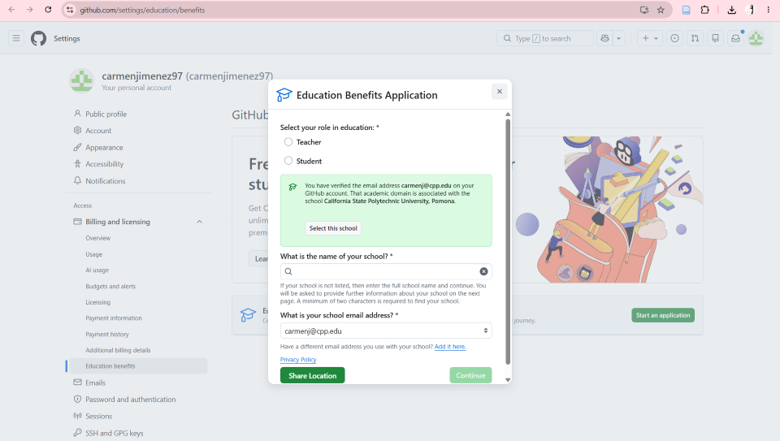

# Introduction

::: {.callout-note title="Purpose of This Reflection"}
In this report, I reflect on my first experience with **Positron**, what I liked and found challenging, and how AI tools could help me while I continue learning R and data analysis.
:::

Before this module, I had used RStudio for class assignments, but I had never worked in Positron. At first, the program looked a little unfamiliar because its layout is different. After exploring it, however, I noticed that it brings together many useful tools in the same place: code, files, the R console, Quarto previews, GitHub, and AI support. An application that combines these tools is known as an integrated development environment (IDE).[^1]

[^1]: An IDE combines tools for writing, running, and managing code in one application.

# Downloading and Installing Positron

> **Prompt 1:** Download and Install Positron. As you watch the videos in Step 1 and Step 3, follow the activities in the video and be familiar with Positron.

I downloaded Positron from the official website and installed the Windows user version. I then created a folder called `Intro-Positron` for this assignment and opened that folder in Positron. I also trusted the folder so that all the program's features would be available.

One thing that made the setup easier was that Positron automatically detected **R 4.5.2** and **Quarto 1.9.38**, which were already installed on my computer. I created this QMD file, added a YAML header, and used the Preview button to generate the HTML report. Seeing the report appear next to my source file helped me understand the connection between a QMD file and its rendered HTML version.

During this process, I became familiar with:

1. The **Explorer**, where I can see the files in my project.
2. The **Editor**, where I write the report and code.
3. The **Console**, where R commands and results appear.
4. The **Viewer**, where I can preview the HTML report.
5. The **Command Palette**, which helps me find commands without searching through many menus.

::: {.callout-tip title="What I learned from the setup"}
Opening the entire folder as a project keeps the QMD file, HTML report, images, and GitHub materials together. This makes the assignment much easier to organize.
:::

# Positron Compared with RStudio

> **Prompt 2:** Based on what you learned from Step 1 and Step 3, what do you like about Positron compared with RStudio?

RStudio still feels more familiar to me because I have already used it in previous assignments. However, Positron looks more modern and gives me more flexibility. I like that it was designed for both R and Python, so I could continue using it if I work with another programming language in the future.

I also liked the Explorer because it shows the whole project structure clearly. The Command Palette was another useful feature. Instead of trying to remember where every option is located, I can search for the action I need. Table @tbl-comparison summarizes the differences that stood out to me.

| Feature | Positron | RStudio |
|---|---|---|
| Languages | Designed for R and Python | Mainly focused on R |
| Appearance | Modern and customizable | More familiar and traditional |
| Finding commands | Searchable Command Palette | Mostly menus and panes |
| AI tools | Built into the current workflow | Usually requires additional setup |
| Project files | Full project Explorer | Files pane and R projects |

: Features I noticed in Positron and RStudio {#tbl-comparison}

Positron was not immediately easier for me because I had to learn where things were located. Still, after using it to create and preview this report, I could see why it may be useful for future marketing analytics projects. It allows me to write, analyze data, organize files, and prepare a final report without constantly changing applications.

> “For me, the biggest advantage of Positron is having the complete project visible and organized in one workspace.”

# Artificial Intelligence in Positron

## Ways to Use AI

> **Prompt 3.1:** Describe the various ways you can use AI inside Positron. Some are free while others are not.

From the videos and my exploration of Positron, I learned that AI can be used in several ways. The available options depend on the provider. Some have free plans or student benefits, while others require a subscription or an API key.

::: {.panel-tabset}

### Chat

AI chat can answer questions about R or Python, explain an error message, and help a user understand code already included in a project.

### Code Suggestions

AI can suggest the next line of code while the user is typing. This can save time and help when I understand the goal but do not remember the exact syntax.

### Debugging

When code does not work, AI can explain possible causes and suggest corrections. The user still needs to test the recommendation.

### Documentation

AI can help write comments, describe an analysis, organize a Quarto report, and explain technical ideas in simpler language.

:::

I think these features are especially helpful for a student who is still becoming comfortable with R. At the same time, AI can produce incorrect code, so its answers should be treated as suggestions rather than automatic solutions.

## AI Tools I Set Up

> **Prompt 3.2:** Which AI tools have you installed or set up? Which AI tools did you find beneficial for you?

For this assignment, I began setting up **GitHub Copilot** for use with Positron. I also explored Positron's AI interface and learned that Copilot can be connected as a language-model provider. The feature I find most beneficial is the ability to ask for an explanation along with a code suggestion. When I am learning, seeing only the final command is not enough; I also want to understand what the command does and why it is appropriate.

This could be useful in my field for tasks such as cleaning customer data, calculating summary statistics, creating visualizations, or organizing results for a marketing report.

::: {.callout-warning title="Using AI responsibly"}
I should always read the suggested code, run it myself, check the output, and make sure it actually answers the question I am working on.
:::

## GitHub Copilot and My Education Application

> **Prompt 3.3:** Apply for GitHub Copilot through an education account, take a screenshot showing you were accepted into the education program, play with it, and explain whether you find it helpful or distracting.

I used my verified Cal Poly Pomona email address to apply for GitHub Education. As shown in Figure @fig-education, GitHub confirmed that my application was submitted. At the time I completed this report, the application was still being reviewed, so I could not include a final acceptance screen yet. I plan to activate the complete student benefit as soon as GitHub finishes the verification.

{#fig-education fig-alt="GitHub message confirming submission of the education application" width=85%}

My first impression of AI coding assistance is that it can be both helpful and distracting. It is helpful when I need a reminder of R syntax, an explanation of an error, or a starting point for a task. It becomes distracting when suggestions appear before I have had time to think through the problem myself. I could also become too dependent on it if I accepted every answer without checking it.

For me, the best approach is to first decide what I am trying to accomplish, use AI for a specific question, and then verify the response. When used this way, I believe Copilot can support my learning rather than replace it.

# Publishing the Report

> **Prompt 4:** Publish this report to GitHub Pages. Note that although both GitHub Pages and the GitHub repo are online, they are different. GitHub Pages is a website publishing service that hosts the rendered HTML from a QMD file.

I published this project using a GitHub repository and GitHub Pages. Although both are online, they have different purposes. The **GitHub repository** stores the project files, including the QMD source and its history. **GitHub Pages** displays the rendered report as a website that another person can read without opening Positron.

In simple terms, the repository contains the materials used to build the project, while GitHub Pages presents the finished report to the reader.

# Final Reflection

This activity showed me that a data project involves more than writing R code. I also need to organize files, explain what I did, present the information clearly, and share the final result. I initially found Positron less familiar than RStudio, but creating this report helped me understand its structure.

I can see myself using Positron again, especially for projects that combine data analysis, Quarto reports, GitHub, and AI assistance. These tools could be valuable in future customer insight and marketing analytics projects, as long as I continue checking my work and do not rely on AI without understanding the results.

# Appendix

> **Prompt 5:** Add the Appendix section at the bottom of your report and provide a URL to the GitHub Pages and GitHub Repo.

- **GitHub Repository:** [W02-M03 Reflection on Introduction to Positron](https://github.com/carmenjimenez97/W02-M03-Reflection-Positron)
- **GitHub Pages:** [Published HTML Report](https://carmenjimenez97.github.io/W02-M03-Reflection-Positron/)

## Quarto Feature Demonstration

The folded example below demonstrates code folding, syntax highlighting, code copying, and code tools.

```{r}
#| label: positron-example
#| echo: true
#| code-fold: true
#| code-summary: "Show demonstration code"

positron_features <- c(
  "R and Python support",
  "Quarto publishing",
  "Data exploration",
  "AI assistance",
  "Git integration"
)

length(positron_features)
```